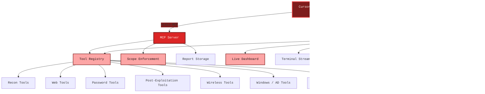

<div align="center">

# Offensive Security MCP Agent
### FastAPI Dashboard + MCP Tool Router for Authorized Security Workflows

[](https://www.python.org/)
[](https://fastapi.tiangolo.com/)
[](https://modelcontextprotocol.io/)
[](#)
[](#tool-categories)
[](#features)
[](LICENSE)

**A local offensive-security MCP platform with a web dashboard, real-time execution streams, scope guardrails, payload generation, and an extensible tool registry for authorized assessments.**

[🏗️ Architecture](#architecture-overview) • [🚀 Installation](#installation) • [🔌 MCP Setup](#mcp-client-integration) • [🛠️ Features](#features) • [📡 API Reference](#api-reference) • [⚠️ Security](#security-considerations)

</div>

---

## Architecture Overview

This project combines a FastAPI control plane, an MCP stdio server, and a registry-driven command layer so AI clients can use curated security tools through one local interface.



### How It Works

1. An MCP-compatible client connects to `mcp_server/mcp_server.py` over stdio.
2. The server exposes registry-defined tools and helper actions like `set_scope`, `search_tools`, and `generate_payload`.
3. The FastAPI app provides a browser dashboard, REST endpoints, WebSocket terminal streaming, and optional Anthropic-backed AI chat.
4. Commands are executed locally, outputs are written to `reports/`, payloads land in `payloads/`, and audit activity is logged in `logs/`.
5. Scope checks help block out-of-scope targets before execution.

---

## Installation

### Quick Setup

```bash
# 1. Clone the repository
git clone https://github.com/ans-inayat/offensive-sec-mcp
cd mcp

# 2. Create and activate a virtual environment
python3 -m venv mcp
source mcp/bin/activate

# 3. Install Python dependencies
pip install -r requirements.txt

# 4. (Kali recommended) install common security tool dependencies
sudo ./install_tools.sh

# 5. Optional: enable AI chat features
export ANTHROPIC_API_KEY="sk-ant-..."
```

### Start the Platform

```bash
# Start the FastAPI dashboard and API
chmod +x start.sh
./start.sh
```

After launch:

- Dashboard: `http://localhost:8000`
- API docs: `http://localhost:8000/docs`
- Health check: `http://localhost:8000/api/health`
- MCP stdio entrypoint: `python3 mcp_server/mcp_server.py`

### Manual Launch

```bash
# API server only
python3 -m uvicorn api_server:app --host 0.0.0.0 --port 8000 --reload

# MCP server only
python3 mcp_server/mcp_server.py
```

---

## Project Structure

```text
mcp/
├── api_server.py              # FastAPI backend, REST API, WebSockets, AI chat
├── start.sh                   # Convenience launcher for the API server
├── install_tools.sh           # Kali preflight + dependency installer
├── requirements.txt           # Python dependencies
├── mcp_server/
│   ├── mcp_server.py          # MCP stdio server
│   └── tools_registry.py      # Tool metadata, schemas, templates
├── static/
│   └── index.html             # Local dashboard frontend
├── logs/                      # Runtime logs and audit files
├── reports/                   # Saved command output
└── payloads/                  # Generated payload files
```

---

## MCP Client Integration

### Claude Desktop / Claude Code

Add this to your Claude MCP config:

```json
{
  "mcpServers": {
    "offensive-security-mcp": {
      "command": "python3",
      "args": [
        "/absolute/path/to/mcp/mcp_server/mcp_server.py"
      ]
    }
  }
}
```

### Cursor or Other MCP Clients

Use the same stdio entrypoint:

```json
{
  "command": "python3",
  "args": [
    "/absolute/path/to/mcp/mcp_server/mcp_server.py"
  ]
}
```

### Useful MCP Tools

- `set_scope` to define authorized targets before active testing
- `get_scope` to inspect the current engagement scope
- `search_tools` to discover relevant tools by keyword
- `list_tools_by_category` to narrow by workflow area
- `suggest_attack_chain` to get a phased recommendation set
- `generate_payload` to create supported `msfvenom` payloads
- `list_reports` and `read_report` to inspect saved outputs

Example workflow:

```text
1. set_scope(targets=["example.com", "10.10.10.0/24"], engagement_name="internal-test")
2. search_tools(query="subdomain")
3. nmap_basic(target="10.10.10.15")
4. nuclei_scan(target="https://example.com")
5. list_reports()
```

---

## Features

### Core Platform Capabilities

- **MCP stdio server** for Cursor, Claude Desktop, Claude Code, and other compatible clients
- **FastAPI backend** with browsable API docs and dashboard hosting
- **Live WebSocket terminal streaming** for command execution visibility
- **Scope guardrails** to help block unauthorized targets
- **Audit logging** for execution tracking and review
- **Payload generation** via supported `msfvenom` formats
- **Anthropic AI chat endpoint** for tool suggestions and operator assistance
- **Registry-driven design** so tools can be extended in one place

### Dashboard and API

- Tool catalog browsing with category, platform, and search filters
- Command preview endpoint before execution
- Real-time session tracking and process termination
- Report and payload listing endpoints
- Generated MCP config endpoint for client setup help

### Tool Coverage

The registry currently defines **74 offensive-security tools** across these categories:

<details>
<summary><b>🔎 Recon</b></summary>

- `nmap_basic`, `nmap_stealth`, `nmap_vuln`
- `masscan`
- `theHarvester`
- `amass_enum`, `subfinder`
- `shodan_search`, `whois_lookup`, `dnsx_resolve`

</details>

<details>
<summary><b>🛰️ Scanning & Enumeration</b></summary>

- `nikto_scan`
- `gobuster_dir`, `gobuster_dns`
- `feroxbuster`, `ffuf_fuzz`
- `nuclei_scan`
- `enum4linux`, `ldap_enum`
- `whatweb`, `snmp_walk`

</details>

<details>
<summary><b>🌐 Web Attacks</b></summary>

- `sqlmap_basic`, `sqlmap_post`
- `xsstrike`
- `commix`
- `wfuzz_param`
- `jwt_tool`
- `cors_scan`

</details>

<details>
<summary><b>💥 Exploitation</b></summary>

- `msfconsole_launch`
- `searchsploit`
- `msfvenom_exe`, `msfvenom_elf`, `msfvenom_php`, `msfvenom_ps1`
- `nc_listener`

</details>

<details>
<summary><b>🔐 Password & Credential Attacks</b></summary>

- `hydra_ssh`, `hydra_http`
- `hashcat_md5`, `hashcat_ntlm`, `hashcat_bcrypt`
- `john_crack`
- `crackmapexec_smb`
- `responder`
- `impacket_secretsdump`
- `kerbrute_userenum`

</details>

<details>
<summary><b>🧬 Post-Exploitation</b></summary>

- `linpeas`, `winpeas`
- `evil_winrm`
- `chisel_server`, `chisel_client`
- `ligolo_proxy`
- `proxychains_exec`
- `mimikatz_logonpasswords`
- `bloodhound_collect`

</details>

<details>
<summary><b>📡 Wireless</b></summary>

- `airmon_start`
- `airodump_scan`, `airodump_capture`
- `aireplay_deauth`
- `aircrack_wpa`
- `eaphammer`
- `hcxdumptool_pmkid`, `hcxtools_convert`
- `wifite`

</details>

<details>
<summary><b>🪟 Windows / Active Directory</b></summary>

- `rubeus_kerberoast`, `rubeus_asreproast`
- `powerview_users`, `powerview_acl`
- `seatbelt_audit`, `sharpup`
- `psexec_lateral`, `wmiexec`

</details>

<details>
<summary><b>🛠️ C2 Frameworks</b></summary>

- `sliver_server`
- `havoc_server`
- `mythic_start`
- `empire_server`

</details>

---

## API Reference

### Core Endpoints

| Method | Endpoint | Description |
|--------|----------|-------------|
| `GET` | `/api/health` | Health check with version and scope summary |
| `GET` | `/api/tools` | List tools with optional category, platform, and search filters |
| `GET` | `/api/tools/categories` | List available tool categories |
| `GET` | `/api/tools/{tool_name}` | Get metadata for one tool |
| `POST` | `/api/tools/build-command` | Build a command preview without execution |
| `POST` | `/api/scope` | Set engagement scope and name |
| `GET` | `/api/scope` | Get current scope |
| `POST` | `/api/payload/generate` | Generate a payload into `payloads/` |
| `GET` | `/api/reports` | List saved reports |
| `GET` | `/api/reports/{filename}` | Read a report file |
| `GET` | `/api/payloads` | List generated payloads |
| `GET` | `/api/audit` | View audit log entries |
| `GET` | `/api/sessions` | List active processes |
| `POST` | `/api/sessions/kill/{pid}` | Terminate a running process |
| `POST` | `/api/mcp/config` | Generate MCP client config |
| `POST` | `/api/ai/chat` | REST-based AI assistant endpoint |
| `WS` | `/ws/terminal` | Real-time command execution stream |
| `WS` | `/ws/ai` | Streaming AI assistant channel |

### Example Requests

Set engagement scope:

```bash
curl -X POST http://localhost:8000/api/scope \
  -H "Content-Type: application/json" \
  -d '{
    "targets": ["example.com", "10.10.10.0/24"],
    "engagement_name": "authorized-assessment"
  }'
```

Preview a command:

```bash
curl -X POST http://localhost:8000/api/tools/build-command \
  -H "Content-Type: application/json" \
  -d '{
    "tool_name": "nmap_basic",
    "args": {
      "target": "10.10.10.15"
    }
  }'
```

Generate an MCP config snippet:

```bash
curl -X POST http://localhost:8000/api/mcp/config \
  -H "Content-Type: application/json" \
  -d '{
    "transport": "stdio",
    "server_host": "localhost",
    "server_port": 8080
  }'
```

---

## Usage Notes

This project is intended for **authorized** testing workflows. A practical agent prompt should clearly state ownership or authorization and ask the AI client to use this MCP server's tools within scope.

Example:

```text
I am conducting an authorized internal assessment for assets owned by my company.
Use the offensive-security MCP tools connected to this environment.
Start by setting scope to 10.10.10.0/24 and example.internal, then suggest a recon workflow.
```

---

## Troubleshooting

### Common Issues

1. **Dashboard does not load**
   ```bash
   ss -tlnp | rg 8000
   python3 -m uvicorn api_server:app --host 0.0.0.0 --port 8000 --reload
   ```

2. **MCP client cannot connect**
   ```bash
   python3 mcp_server/mcp_server.py
   ```
   Confirm the client points to the correct absolute path.

3. **AI chat is unavailable**
   ```bash
   export ANTHROPIC_API_KEY="sk-ant-..."
   ```
   The REST and WebSocket AI features rely on the Anthropic API key being present.

4. **Security tools are missing**
   ```bash
   sudo ./install_tools.sh
   ```
   The installer performs a Kali-focused preflight and attempts to install common dependencies.

---

## Security Considerations

⚠️ This platform can launch real offensive-security tooling from local workflows.

- Use only on systems you own or are explicitly authorized to assess.
- Set scope before running active tools whenever possible.
- Review generated commands and outputs carefully.
- Treat payload generation and credential tooling as high-risk features.
- Keep logs, reports, and payload artifacts secured on disk.

### Intended Use

- Authorized penetration testing
- Internal lab work and training environments
- Red team exercises with written approval
- CTF and educational workflows

### Not Intended For

- Unauthorized access
- Malicious persistence or exfiltration
- Testing outside approved scope

---

## Contributing

Contributions are welcome, especially in these areas:

- Expanding the tool registry with safe, well-documented additions
- Improving dashboard UX and reporting
- Hardening scope validation and audit visibility
- Adding tests for API and MCP server behavior
- Improving client configuration flows and docs

### Development Setup

```bash
git clone https://github.com/ans-inayat/offensive-sec-mcp
cd mcp
python3 -m venv mcp
source mcp/bin/activate
pip install -r requirements.txt
python3 -m uvicorn api_server:app --host 0.0.0.0 --port 8000 --reload
```

---

## License

Licensed under the **GNU General Public License v3.0**. See `LICENSE`.

---

<div align="center">

### Local-First Offensive Security MCP Workflow

**Fast dashboard, MCP-native tooling, live execution streams, and scope-aware operator workflows in one local platform.**

</div>
